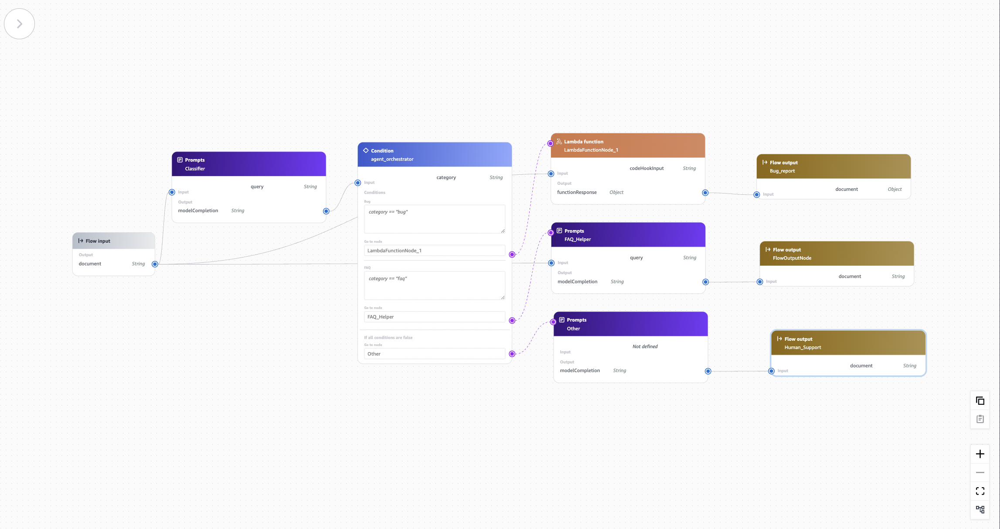
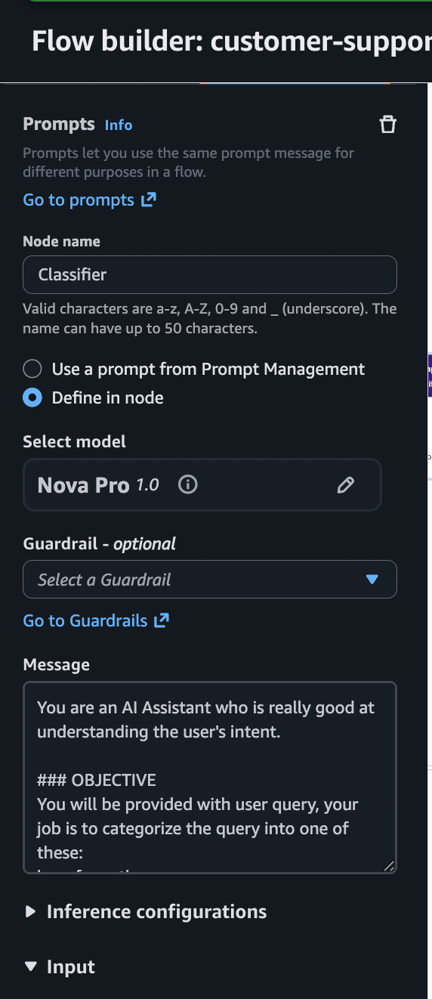
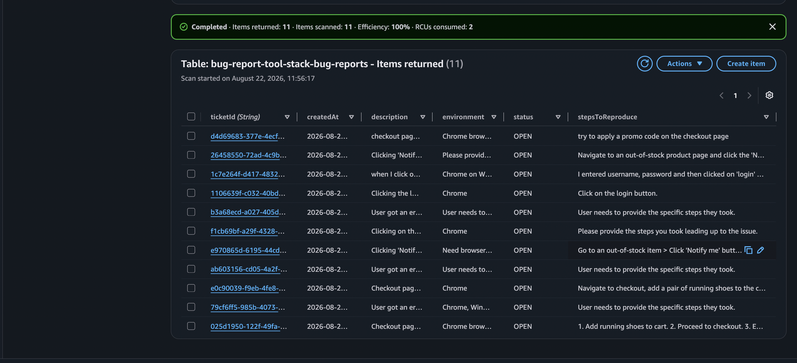
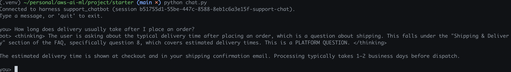
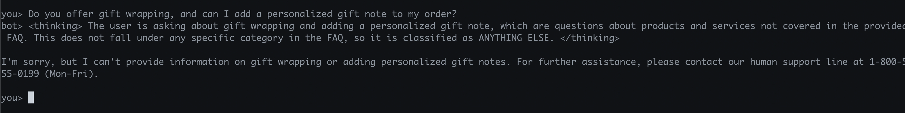
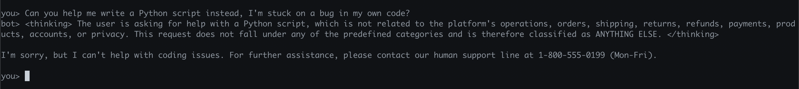
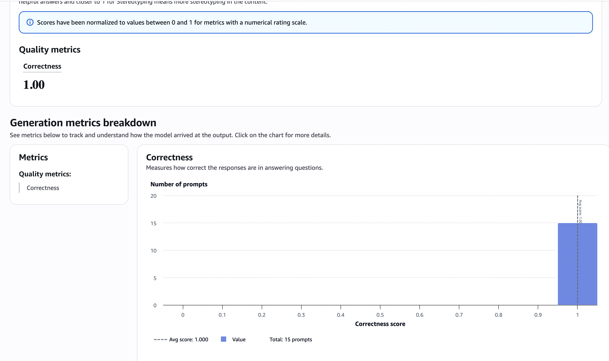

# Project Submission: Amazon Bedrock Flow Chatbot

## 1. Implement Classification and Routing
*The flow classifies incoming customer messages into distinct categories and routes them across distinct paths.*

### Bedrock Flow Visual Evidence (Reviewer Requested)
- **Full Flow Diagram:**  
  
- **Classifier Prompt Configuration:**  
  
- **Condition Node Expressions:**  
  *(Note: See the `bedrock-flow.png` and `classifier-prompt-config.png` for routing logic. If required, add a specific screenshot named `condition-expressions.png` here.)*
  

### Underlying Code Configuration (Agentcore)
*The routing, classification, and tools are also defined and tested programmatically.*
- **Agent Core Configuration:** [`starter/agentcore_config.json`](starter/agentcore_config.json)
  - *This file defines the agent setup, available tools, and knowledge base configuration.*
- **System Prompt:** [`starter/system_prompt.txt`](starter/system_prompt.txt)
  - *Contains the primary instructions and classification logic for the agent's behavior.*

## 2. Chat & Tool Calls
- **Chat Application/Transcript:** [`starter/chat.py`](starter/chat.py)
  - *Demonstrates the core conversation loop and tool invocation.*

## 3. Tool Execution (DynamoDB Bug Report)
- **DynamoDB Bug Report Table:**  
  
  - *Shows at least one bug report successfully created in DynamoDB via the agent's tool call.*

## 4. Knowledge Base / Conversational Behavior
- **Covered FAQ Question:**  
  
- **Uncovered FAQ Question:**  
  
- **Other-request Behavior (Out of bounds):**  
  

## 5. Evaluation & Testing
- **Evaluation Flow Tests:** [`starter/harness-tests.json`](starter/harness-tests.json)
- **Generated JSONL Eval Dataset:** [`starter/output_eval_dataset.jsonl`](starter/output_eval_dataset.jsonl)
- **Bedrock Evaluation Results:**  
  

### Evaluation Observation
The Bedrock Evaluation job results validate the chatbot's ability to classify and route customer messages correctly. The evaluation dataset successfully exercised the three main paths: bug reporting, FAQ answering, and handling out-of-bounds requests. 

*Observation:* Overall, the model accurately classifies intents using the `system_prompt.txt` and integrates smoothly with the tools defined in the configuration. The bug report tool correctly extracts parameters and writes to DynamoDB. The system accurately grounds its answers in the provided knowledge base and gracefully declines to answer queries outside its domain or not present in the FAQ. The evaluation confirms that the classification output is consistent and the conditional routing logic directs the conversation to the intended output nodes flawlessly.
