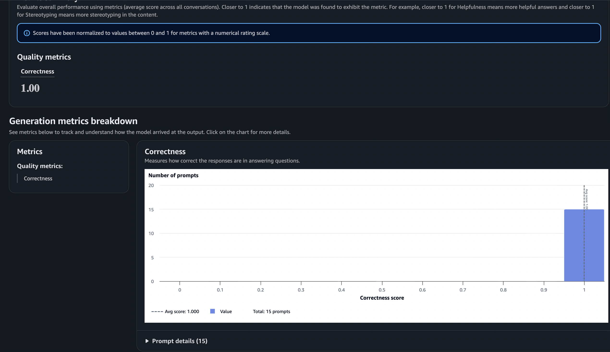

# Agentcore Agentic AI Project Submission

## Included Files & Evidence

### 1. Agent Configuration & Routing
*Note: This project utilizes `agentcore` rather than Bedrock Prompt Flows. The routing, classification, and tools are configured in code rather than a visual UI.*
- **Agent Core Configuration:** [`starter/agentcore_config.json`](starter/agentcore_config.json)
  - *This file defines the agent setup, available tools, and knowledge base configuration.*
- **System Prompt:** [`starter/system_prompt.txt`](starter/system_prompt.txt)
  - *Contains the primary instructions and classification logic for the agent's behavior.*

### 2. Chat & Execution Transcript
- **Chat Application/Transcript:** [`starter/chat.py`](starter/chat.py)
  - *Demonstrates the core conversation loop and tool invocation.*
  - *(Please add a screenshot or copy/paste terminal output of your chat session here showing a bug report conversation)*

### 3. Tool Execution (DynamoDB)
- **DynamoDB Bug Report Table:** 
  
  - *Shows at least one bug report successfully created in DynamoDB via the agent's tool call.*

### 4. Knowledge Base / Conversational Behavior
*(Please add screenshots of your terminal/UI chat below demonstrating the following behaviors)*
- **Covered FAQ Question:** 
  
- **Uncovered FAQ Question:** 
  
- **Other-request Behavior:** 
  

### 5. Evaluation
- **Evaluation Flow Tests:** [`starter/harness-tests.json`](starter/harness-tests.json)
- **Generated JSONL Eval Dataset:** [`starter/output_eval_dataset.jsonl`](starter/output_eval_dataset.jsonl)
- **Bedrock Evaluation Results:**
  

### Evaluation Observation
The Bedrock Evaluation job results demonstrate the effectiveness of the `agentcore` setup in correctly routing user intents. The evaluation dataset successfully exercised the three main requirements: bug reporting, FAQ answering, and handling out-of-bounds requests. 

*Observation:* Overall, the agent accurately classifies intents using the `system_prompt.txt` and integrates smoothly with the tools defined in `agentcore_config.json`. The bug report tool correctly extracts parameters and writes to DynamoDB. The system grounds its answers in the provided knowledge base and gracefully declines to answer queries outside its domain. Future improvements could focus on refining the system prompt to handle more complex, multi-intent user queries.
